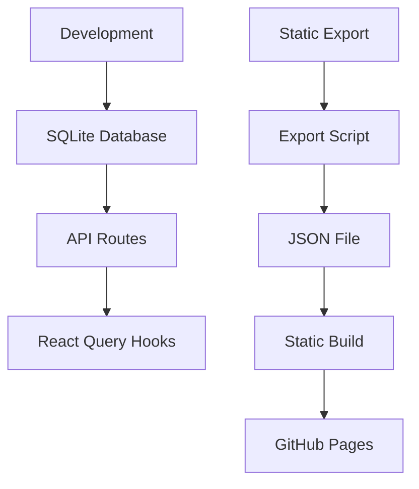

# SQLite Migration Guide

## Overview

This project has been successfully migrated from JSON-based data storage to SQLite, while maintaining the ability to export as a static site for GitHub Pages deployment.

## Architecture

### Development Mode
- **Database**: SQLite (`./data/recipes.db`)
- **API Routes**: All CRUD operations use SQLite via `/src/lib/database.ts`
- **Data Fetching**: Client-side hooks fetch from `/api/data` endpoint

### Static Export Mode
- **Data Source**: JSON file (`/public/data/data.json`)
- **Build Process**: SQLite data is exported to JSON before build
- **Deployment**: Static files can be deployed to GitHub Pages

## Data Flow



## Scripts

### Migration Commands
```bash
# Migrate existing JSON data to SQLite
npm run migrate

# Export SQLite data to JSON (for static builds)
npm run export:json

# Full static export (exports JSON + builds static site)
npm run export
```

### Development Workflow
```bash
# Start development server with SQLite backend
npm run dev

# All recipes, tags, and config changes are stored in SQLite
# API routes handle CRUD operations
```

### Deployment Workflow
```bash
# Export to static site for GitHub Pages
npm run export

# The export command:
# 1. Exports SQLite data to public/data/data.json
# 2. Builds static Next.js site
# 3. Static site uses JSON data for client-side hydration
```

## Data Format Migration

The migration automatically converts legacy ingredient formats:

**Legacy Format** (string array):
```json
{
  "ingredients": ["1 cup flour", "2 eggs", "1 cup milk"]
}
```

**New Format** (GroupData array):
```json
{
  "ingredients": [
    {
      "label": "",
      "items": ["1 cup flour", "2 eggs", "1 cup milk"]
    }
  ]
}
```

## File Structure

```
src/
├── lib/
│   ├── database.ts          # SQLite operations
│   ├── data-config.ts       # Environment detection
│   └── types.ts            # TypeScript definitions
├── app/api/
│   ├── data/route.ts       # GET all data (dev mode)
│   ├── recipes/route.ts    # Recipe CRUD
│   ├── tags/route.ts       # Tag CRUD
│   └── config/route.ts     # User config
└── hooks/
    ├── use-recipes.ts      # Recipe data fetching
    └── use-tags.ts         # Tag data fetching

scripts/
├── migrate-to-sqlite.mjs   # JSON → SQLite migration
└── export-to-json.mjs      # SQLite → JSON export

data/
└── recipes.db              # SQLite database (gitignored)

public/data/
└── data.json               # Static export data
```

## Environment Detection

The app automatically detects the environment and chooses the appropriate data source:

- **Development**: Uses SQLite + API routes
- **Static Export**: Uses JSON file
- **Detection**: Based on `process.env.NEXT_OUTPUT_MODE === 'export'`

## Benefits

1. **Robust Development**: SQLite provides proper database operations, transactions, and indexing
2. **Static Export**: Maintains ability to deploy to GitHub Pages as static site  
3. **Data Integrity**: SQLite ensures data consistency and supports proper relationships
4. **Performance**: Indexed queries and optimized storage
5. **Backward Compatibility**: Existing JSON data is automatically migrated

## Database Schema

### Recipes Table
```sql
CREATE TABLE recipes (
  id TEXT PRIMARY KEY,
  title TEXT NOT NULL,
  ingredients TEXT NOT NULL,  -- JSON array of GroupData
  instructions TEXT NOT NULL, -- JSON array of strings  
  tags TEXT NOT NULL,         -- JSON array of tag IDs
  total_time TEXT,
  yield TEXT,
  archived INTEGER DEFAULT 0,
  created_at TEXT NOT NULL,
  last_modified TEXT NOT NULL
);
```

### Tags Table
```sql
CREATE TABLE tags (
  id TEXT PRIMARY KEY,
  display_name TEXT NOT NULL
);
```

### User Config Table
```sql
CREATE TABLE user_config (
  key TEXT PRIMARY KEY,
  value TEXT NOT NULL
);
```

## Migration Notes

- Original JSON data is preserved in `/public/data/` as backup
- SQLite database is stored in `/data/recipes.db` (gitignored)
- All existing API contracts remain unchanged
- Component code requires no modifications
- Ingredients format is automatically upgraded during migration
